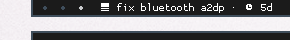

# taskwarrior-polybar
merely just a script showing the most urgent task and allowing it to be marked done



Place `task_polybar.sh` in your `$XDG_CONFIG_HOME/polybar` folder and add the following module to your `config` file:

```ini
[module/taskwarrior]
interval = 30
type = custom/script
exec = $XDG_CONFIG_HOME/polybar/task_polybar.sh
format = <label>
format-foreground = #FFF
format-prefix = " "
click-left = task "$((`cat /tmp/tw_polybar_id`))" done
```

The font here used for special characters is Wuncon Siji.
